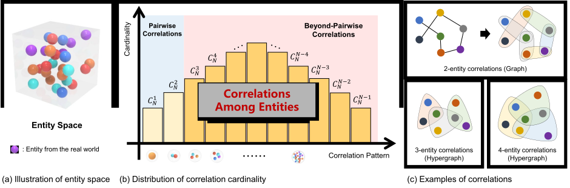
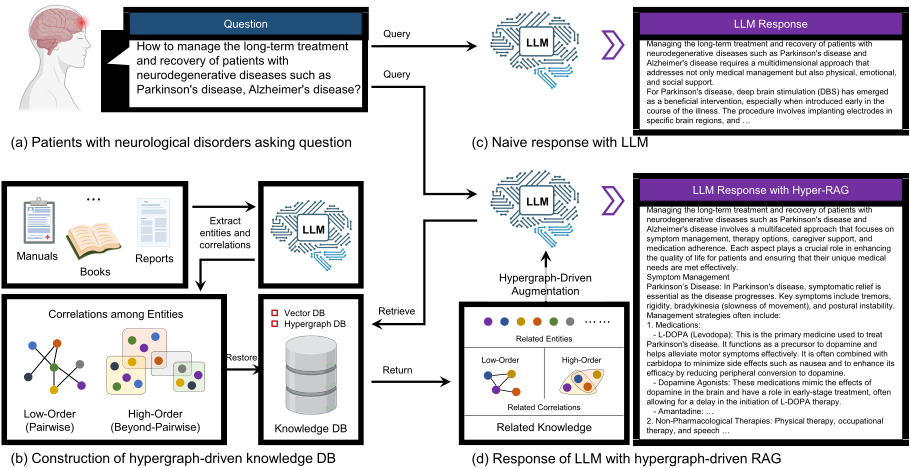
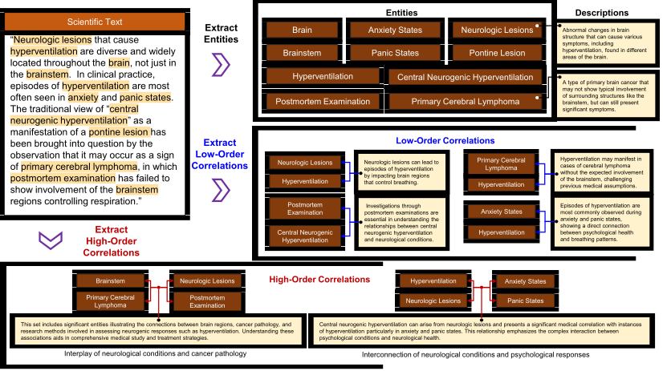
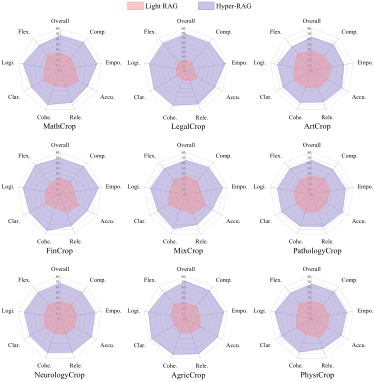
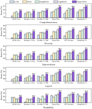
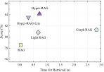

<!-- <div align="center" id="top"> 
  
</div> -->

<h1 align="center">Hyper-RAG</h1>

<p align="center">
  

  

  

  

  <!--  -->

  <!--  -->

  
</p>

<p align="center">
  <a href="#dart-about">About</a> &#xa0; | &#xa0; 
  <a href="#sparkles-why-hyper-rag-is-more-powerful">Features</a> &#xa0; | &#xa0;
  <a href="#rocket-installation">Installation</a> &#xa0; | &#xa0;
  <a href="#white_check_mark-quick-start">Quick Start</a> &#xa0; | &#xa0;
  <a href="#checkered_flag-evaluation">Evaluation</a> &#xa0; | &#xa0;
  <a href="#memo-license">License</a> &#xa0; | &#xa0;
  <a href="https://github.com/yifanfeng97" target="_blank">Author</a>
</p>

<br>


<div align="center">
  
</div>
We show that Hyper-RAG is a powerful RAG that can enhance the performance of various LLMs and outperform other SOTA RAG methods in the NeurologyCorp dataset. Our paper is available at <a href="https://github.com/iMoonLab/Hyper-RAG/blob/main/assets/Hyper-RAG.pdf">here</a>.

## :dart: About

<details>
<summary> <b>Abstract</b> </summary>
Large language models (LLMs) have transformed various sectors, including education, finance, and medicine, by enhancing content generation and decision-making processes. However, their integration into the medical field is cautious due to hallucinations, instances where generated content deviates from factual accuracy, potentially leading to adverse outcomes. To address this, we introduce Hyper-RAG, a hypergraph-driven Retrieval-Augmented Generation method that comprehensively captures both pairwise and beyond-pairwise correlations in domain-specific knowledge, thereby mitigating hallucinations. Experiments on the NeurologyCrop dataset with six prominent LLMs demonstrated that Hyper-RAG improves accuracy by an average of 12.3% over direct LLM use and outperforms Graph RAG and Light RAG by 6.3% and 6.0%, respectively. Additionally, Hyper-RAG maintained stable performance with increasing query complexity, unlike existing methods which declined. Further validation across nine diverse datasets showed a 35.5% performance improvement over Light RAG using a selection-based assessment. The lightweight variant, Hyper-RAG-Lite, achieved twice the retrieval speed and a 3.3\% performance boost compared with Light RAG. These results confirm Hyper-RAG's effectiveness in enhancing LLM reliability and reducing hallucinations, making it a robust solution for high-stakes applications like medical diagnostics.
</details>

<br>

<div align="center">
  
</div>
Schematic diagram of the proposed Hyper-RAG architecture. a, The patient poses a question. b, A knowledge base is constructed from relevant domainspecific corpora. c, Responses are generated directly using LLMs. d, Hyper-RAG generates responses by first retrieving relevant prior knowledge from the knowledge base and then inputting this knowledge, along with the patient’s question, into the LLMs to formulate the reply.

<br>
<br>

<details>
<summary> <b>More details about hypergraph modeling</b> </summary>
<div align="center"> 
  
Example of hypergraph modeling for entity space. Hypergraph can model the beyond-pairwise relationship among entities, which is more powerful than the pairwise relationship in traditional graph modeling. With hypergraphs, we can avoid the information loss caused by the pairwise relationship.
</div>
<br>
<div align="center"> 
  
  Illustration of Entity and Correlation Extraction from Raw Corpus: Dark brown boxes represent entities, blue arrows denote low-order correlations between entities, and red arrows indicate high-order correlations. Yellow boxes contain the original descriptions of the respective entities or their correlations.
</div>
</details>

<br>

## :sparkles: Why Hyper-RAG is More Powerful

:heavy_check_mark: **Comprehensive Relationship Modeling with Hypergraphs**: Utilizes hypergraphs to thoroughly model the associations within the raw corpus data, providing more complex relationships compared to traditional graph-based data organization.;\
:heavy_check_mark: **Native Hypergraph-DB Integration**: Employs the native hypergraph database, <a href="https://github.com/iMoonLab/Hypergraph-DB">Hypergraph-DB</a>, as the foundation, supporting rapid retrieval of higher-order associations.;\
:heavy_check_mark: **Superior Performance**: Hyper-RAG outperforms Graph RAG and Light RAG by 6.3% and 6.0% respectively.;\
:heavy_check_mark: **Broad Validation**: Across nine diverse datasets, Hyper-RAG shows a 35.5% performance improvement over Light RAG based on a selection-based assessment.;\
:heavy_check_mark: **Efficiency**: The lightweight variant, Hyper-RAG-Lite, achieves twice the retrieval speed and a 3.3% performance boost compared to Light RAG.;

## :rocket: Installation


```bash
# Clone this project
git clone https://github.com/iMoonLab/Hyper-RAG.git

# Access
cd Hyper-RAG

# Install dependencies
pip install -r requirements.txt
```

## :white_check_mark: Quick Start

### Configure your LLM API
Copy the `config_temp.py` file to `my_config.py` and set your LLM URL and KEY.

```python
LLM_BASE_URL = "Yours xxx"
LLM_API_KEY = "Yours xxx"
LLM_MODEL = "gpt-4o-mini"

EMB_BASE_URL = "Yours xxx"
EMB_API_KEY = "Yours xxx"
EMB_MODEL = "text-embedding-3-small"
EMB_DIM = 1536
```

### Run the toy example

```bash
python example/hyperreg_demo.py
```

### Or Run by Steps

1. Prepare the data. You can download the dataset from <a href="https://cloud.tsinghua.edu.cn/d/187386488d5c404a83a5/">here</a>. Put the dataset in the root direction. Then run the following command to preprocess the data.

```bash
python reproduce/Step_0.py
```

2. Build the knowledge hypergraphs, and entity and relation vector database with following command.

```bash
python reproduce/Step_2.py
```

3. Extract questions from the orignial datasets with following command.

```bash
python reproduce/Step_3_extract_question.py
```

Those questions are saved in the `cache/{{data_name}}/questions` folder. 

4. Run the Hyper-RAG to response those questions with following command.

```bash
python reproduce/Step_4_response_question.py
```

Those response are saved in the `cache/{{data_name}}/response` folder.

You can also change the `mode` parameter to `hyper` or `hyper-lite` to run the Hyper-RAG or Hyper-RAG-Lite.


## :checkered_flag: Evaluation
In this work, we propose two evaluation strategys: the **selection-based** and **scoring-based** evaluation. 

### Scoring-based evaluation
Scoring-Based Assessment is designed to facilitate the comparative evaluation of multiple model outputs by quantifying their performance across various dimensions. This approach allows for a nuanced assessment of model capabilities by providing scores on several key metrics. However, a notable limitation is its reliance on reference answers. In our preprocessing steps, we leverage the source chunks from which each question is derived as reference answers.

You can use the following command to use this evaluation method.

```bash
python evaluate/evaluate_by_scoring.py
```
The results of this evaluation are shown in the following figure.
<div align="center">
  
</div>


### Selection-based evaluation
Selection-Based Assessment is tailored for scenarios where preliminary candidate models are available, enabling a comparative evaluation through a binary choice mechanism. This method does not require reference answers, making it suitable for diverse and open-ended questions. However, its limitation lies in its comparative nature, as it only allows for the evaluation of two models at a time.

You can use the following command to use this evaluation method.

```bash
python evaluate/evaluate_by_selection.py
```
The results of this evaluation are shown in the following figure.
<div align="center">
  
</div>


### Efficiency Analysis
We conducted an efficiency analysis of our Hyper-RAG method using GPT-4o mini on the NeurologyCrop dataset, comparing it with standard RAG, Graph RAG, and Light RAG. To ensure fairness by excluding network latency, we measured only the local retrieval time for relevant knowledge and the construction of the prior knowledge prompt. While standard RAG focuses on the direct retrieval of chunk embeddings, Graph RAG, Light RAG, and Hyper-RAG also include retrieval from node and correlation vector databases and the time for one layer of graph or hypergraph information diffusion. We averaged the response times over 50 questions from the dataset for each method. The results are shown in the following figure.

<div align="center">
  
</div>

## :memo: License

This project is under license from Apache 2.0. For more details, see the [LICENSE](LICENSE.md) file.

Hyper-RAG is maintained by [iMoon-Lab](http://moon-lab.tech/), Tsinghua University. 
Made with :heart: by <a href="https://github.com/yifanfeng97" target="_blank">Yifan Feng</a>, <a href="https://github.com/haoohu" target="_blank">Hao Hu</a>, <a href="https://github.com/yifanfeng97" target="_blank">Xingliang Hou</a>, <a href="https://github.com/yifanfeng97" target="_blank">Shiquan Liu</a>, <a href="https://github.com/FuYou0723" target="_blank">Yifan Zhang</a>. 

If you have any questions, please feel free to contact us via email: [Yifan Feng](mailto:evanfeng97@gmail.com). 

This repo benefits from [LightRAG](https://github.com/HKUDS/LightRAG) and [Hypergraph-DB](https://github.com/iMoonLab/Hypergraph-DB).  Thanks for their wonderful works.

&#xa0;

<a href="#top">Back to top</a>
