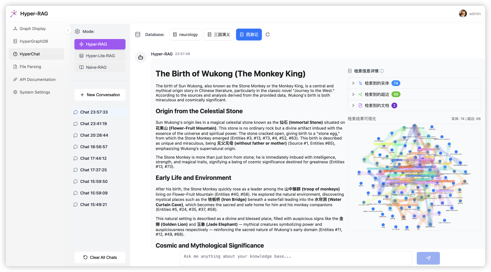
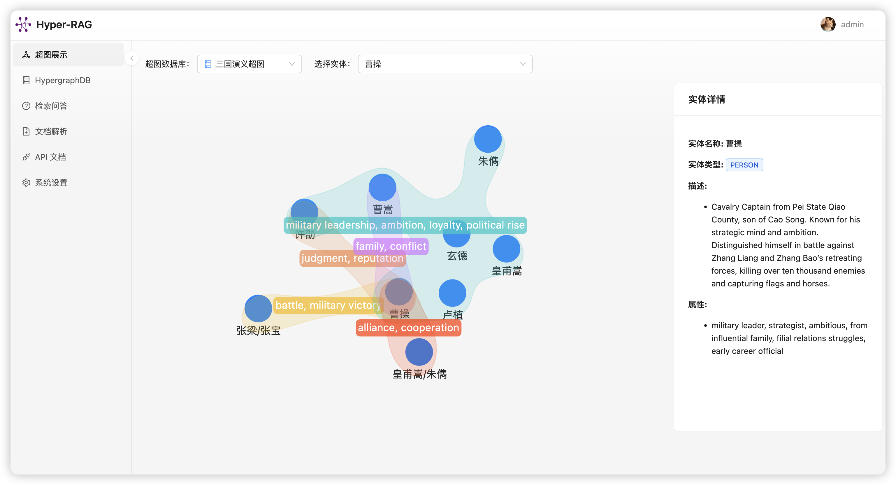
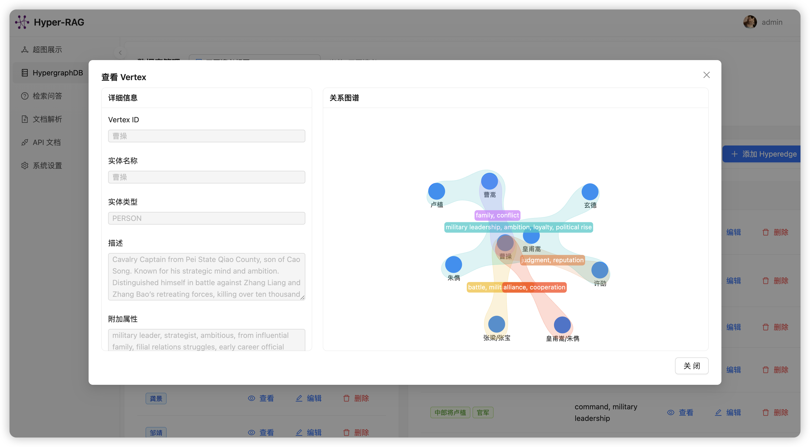
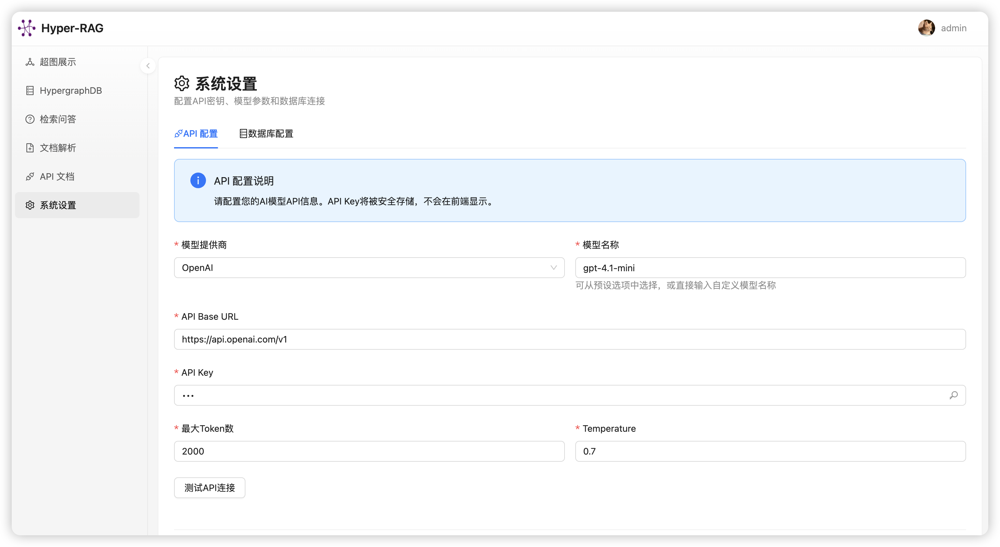
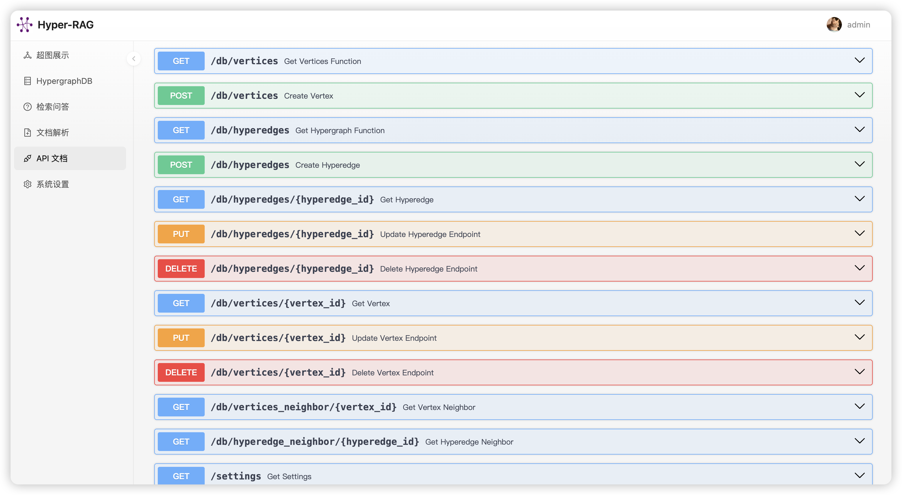

# HyperRAG Web UI

HyperRAG Web UI 是一个基于 React + FastAPI 的全栈 Web 应用，为 HyperRAG 系统提供了完整的可视化界面和管理功能。

## 📖 项目概述

HyperRAG Web UI 提供了一个直观的 Web 界面来管理和使用 HyperRAG 系统，包括超图可视化、文档管理、检索问答等功能。

## 🚀 快速开始

### 环境要求

- Node.js 16+
- Python 3.8+
- npm/yarn

### 后端启动

1. 进入后端目录：

```bash
cd web-ui/backend
```

2. 安装依赖：

```bash
pip install -r requirements.txt
```

可下载解析好的 3 个 demo 数据库 [here](https://pan.baidu.com/s/1mrDJVpMW59gLtRRSXafXdw?pwd=w642#list/path=%2Fsharelink484952695-6132723540665%2FHyper-RAG%2Fweb-ui&parentPath=%2Fsharelink484952695-6132723540665).

解压后复制到 `web-ui/backend/hyperrag_cache` 目录下

3. 启动开发服务器：

```bash
fastapi dev main.py
```

### 前端启动

1. 进入前端目录：

```bash
cd web-ui/frontend
```

2. 安装依赖：

```bash
npm install
# 或
pnpm install
```

3. 启动开发服务器：

```bash
npm run dev
```

前端应用将在 `http://localhost:5173` 启动

## 📱 界面预览

### 主要页面

- **首页**: 智能对话界面，支持多轮问答
- **超图展示**: 交互式超图可视化展示
- **数据库管理**: 完整的超图数据 CRUD 操作
- **文档管理**: 文件上传和嵌入进度监控
- **系统设置**: 模型配置和连接管理

## ✨ 主要功能

### 🔍 检索问答 (QA)

- 智能对话界面，支持多种查询模式
- 支持 `hyper`、`hyper-lite`、`naive` 三种查询模式
- 对话历史管理和持久化存储
  

### 📊 超图展示 (Graph)

- 交互式超图可视化
- 支持节点和超边的详细信息查看
- 动态图形布局和缩放功能
- 超图渲染
  

### 🗄️ HypergraphDB 管理 (DB)

- 完整的超图数据库管理界面
- 支持顶点 (Vertices) 和超边 (Hyperedges) 的 CRUD 操作
- 数据库切换和状态管理
- 邻居节点查询和关系分析
  
  

### 📁 文档解析 (Files)

- 拖拽式文件上传界面
- 支持多种文档格式 (PDF, DOCX, TXT, Markdown)
- 实时文档嵌入进度显示
- WebSocket 实时日志监控
- 批量文档处理和管理
  

### ⚙️ 系统设置 (Setting)

- LLM 模型配置 (OpenAI, 其他兼容 API)
- 嵌入模型设置和参数调整
- 数据库连接管理
- API 连接测试工具
  

### 📚 API 文档 (API)

- 内置 FastAPI 自动生成的 API 文档
- 交互式 API 测试界面
- 完整的接口说明和示例
  

## 🛠️ 技术栈

### 前端技术

- **React 18** - 主要框架
- **Ant Design & Ant Design Pro** - UI 组件库
- **Radix UI** - 现代化 UI 组件
- **AntV G6** - 图形可视化
- **React Router** - 路由管理
- **MobX** - 状态管理
- **Tailwind CSS** - 样式框架
- **Vite** - 构建工具

### 后端技术

- **FastAPI** - 现代 Python Web 框架
- **Uvicorn** - ASGI 服务器
- **Pydantic** - 数据验证
- **SQLAlchemy** - ORM
- **WebSocket** - 实时通信
- **OpenAI API** - LLM 集成

## 🔧 配置说明

### 后端配置

- **LLM 配置**: 支持 OpenAI 和其他兼容 API
- **嵌入模型**: 支持多种嵌入模型配置
- **数据库**: 支持多数据库切换
- **缓存**: 自动缓存管理

### 前端配置

- **API 地址**: 自动检测后端服务地址
- **主题**: 支持亮色/暗色主题
- **布局**: 响应式设计，适配多种屏幕

## 🔗 API 文档

访问 `http://127.0.0.1:8000/docs` 查看完整的 API 文档，包括：

### 核心 API

- `GET /db` - 获取超图数据
- `POST /hyperrag/query` - 智能问答查询
- `POST /hyperrag/insert` - 文档插入
- `POST /files/upload` - 文件上传
- `POST /files/embed` - 文档嵌入

### 管理 API

- `GET /settings` - 获取系统设置
- `POST /settings` - 保存系统设置
- `GET /databases` - 获取数据库列表
- `POST /test-api` - 测试 API 连接

## 📊 实时监控

### WebSocket 支持

- 实时日志监控
- 文档处理进度
- 系统状态更新

### 进度追踪

- 文件上传进度
- 嵌入处理进度
- 错误状态提醒
